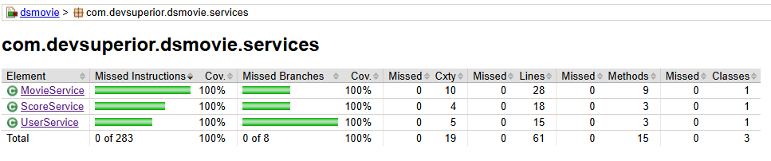

Java Spring Expert

DESAFIO: - Desafio DSMovie Jacoco (cap5)

## Aluno : Marcio Coelho Pereira do Carmo Neto 

"Abaixo estão os testes unitários que você deverá implementar. Com todos os testes, o Jacoco deve reportar 100% de cobertura, mas o mínimo para aprovação no desafio são 12 dos 15 testes.:"

#### MovieServiceTests:
findAllShouldReturnPagedMovieDTO
findByIdShouldReturnMovieDTOWhenIdExists
findByIdShouldThrowResourceNotFoundExceptionWhenIdDoesNotExist
insertShouldReturnMovieDTO
updateShouldReturnMovieDTOWhenIdExists
updateShouldThrowResourceNotFoundExceptionWhenIdDoesNotExist
deleteShouldDoNothingWhenIdExists
deleteShouldThrowResourceNotFoundExceptionWhenIdDoesNotExist
deleteShouldThrowDatabaseExceptionWhenDependentId

#### ScoreServiceTests:
saveScoreShouldReturnMovieDTO
saveScoreShouldThrowResourceNotFoundExceptionWhenNonExistingMovieId

#### UserServiceTests:
authenticatedShouldReturnUserEntityWhenUserExists
authenticatedShouldThrowUsernameNotFoundExceptionWhenUserDoesNotExists
loadUserByUsernameShouldReturnUserDetailsWhenUserExists
loadUserByUsernameShouldThrowUsernameNotFoundExceptionWhenUserDoesNotExists

"

### Competências avaliadas:

- Testes unitários em projeto Spring Boot com Java

- Implementação de testes unitários com JUnit e Mockito

- Cobertura de código com Jacoco

#### Resultado obtido

